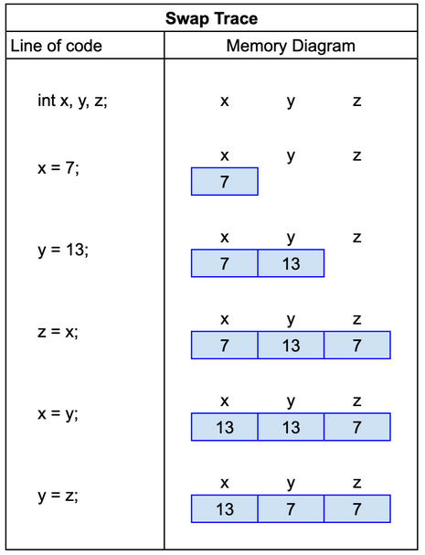

Worked Example: Swap
======================================================

.. topic:: Subgoals for evaluating an assignment statement

   1. Determine resultant data type of expression
   2. Update variable for pre-increment or pre-decrement operators (side effect)
   3. Evaluate arithmetic expression according to operator precedence
   4. If an assignment statement (=), is Left Hand Side (LHS) a variable? Check data type of value against data type of variable.
   5. Update variable for post-increment or post-decrement operators (side effect)

You can watch this video or read through the content below it.

.. youtube:: F8aNpe_sSmE
   :divid: video-express-we9-swap
   :align: center

Consider these declarations.
    
.. code-block:: java

   int x,y,z;
   x = 7;
   y = 13;

Now consider this code for swapping the values of x and y. Note the need for a third variable to hold the value of x so that it is not lost when assigning the value of y into x.

.. code-block:: java

   z = x;
   x = y;
   y = z;

The diagram below shows the changes in memory after executing each of the six lines of code.

.. topic:: Practice Pages

   .. toctree::
      :maxdepth: 1

      expressions-we10-p1.rst
      expressions-assess-swap.rst