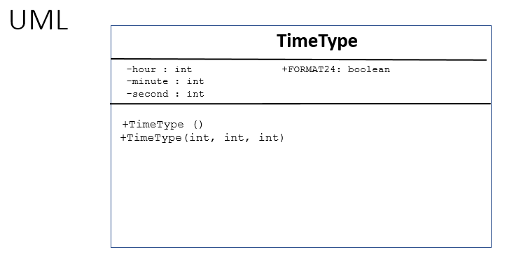

Worked Example: Writing Classes - Constructors
==================================================

.. topic:: Subgoals for Writing a Class 2/4

   1. Name it 

   2. Differentiate class-level (static) vs. instance/object-level variables  

   3. Differentiate class-level (static) vs. instance/object behaviors/methods 
   

   4. Define class variables (static) as needed '
   
      A. Name 
      B. Data Type 
      C. public / private / final 
      
      
   5. Define instance variables (that you want to be interrelated)  

      A. Name 
      B. Data Type 
      C. private 
      
   6. Create constructor (behavior) that creates initial state of object  

      A. public
      B. Same name as class
      C. No return type
      D. Default - no parameters
      E. Logic - initialize all variables
      F. Repeat as needed, adding parameters 
      

You can watch this video or read through the content below it.

.. youtube:: FR6XCRrf_To
   :divid: video-writeclass-we2
   :align: center

--------------------------------------------------------------------------------------------------------------------------------------------------------------------------------------------

Problem: We will be writing a class to represent an instance of time, like a specific time in the day.

The attributes have been declared, now write a default and overloaded constructor.

   
---------------------------------------------------------------------------------------------------------

.. topic:: SG6: Create constructor (behavior) that creates initial state of object

   6A, 6B, & 6C: All constructors are public, with no return type, and named the same as the class.
   
   6D: We will start with the default constructor, which has no parameters.
   
   All together, the default constructor has a header/signature of:
   
   .. code-block:: java
   
      public TimeType() {
      
      }
      
   6E. Logic - initialize all variables
   
   .. code-block:: java
   
      public TimeType () {
         hour = 0;
         minute = 0;
         second = 0;
      }

   6F. Repeat as needed, adding parameters 
   
   .. code-block:: java
   
      public TimeType (int hr, int min, int sec) {
      
         if (hr >=0 && hr <= 23)
            hour = hr;
         if (min >= 0 && min <= 59)
            minute = min;
         if (sec >= 0 && sec <= 59)
            second = sec;
      }

We are now able to construct TimeType objects from the main method in two ways

.. code-block:: java
      
   public static void main (String [] args) {
      TimeType midnight = new TimeType(); //call the default constructor
      TimeType noon = new TimeType(12, 0, 0); //call an overloaded constructor
   }

Update the UML Diagram

   
   
.. topic:: Practice Pages

   .. toctree::
      :maxdepth: 1

      classes-we2-p1.rst
      classes-we2-p2.rst