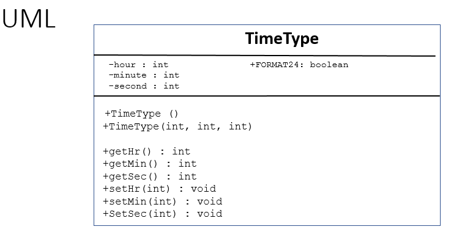

Worked Example: Writing Classes - Getters and Setters
========================================================

.. topic:: Subgoals for Writing a Class 3/4

   1. Name it 

   2. Differentiate class-level (static) vs. instance/object-level variables  

   3. Differentiate class-level (static) vs. instance/object behaviors/methods 
   

   4. Define class variables (static) as needed '
   
      A. Name 
      B. Data Type 
      C. public / private / final 
      
      
   5. Define instance variables (that you want to be interrelated)  

      A. Name 
      B. Data Type 
      C. private 
      
      
   6. Create constructor (behavior) that creates initial state of object  

      A. public
      B. Same name as class
      C. No return type
      D. Default - no parameters
      E. Logic - initialize all variables
      F. Repeat as needed, adding parameters 
      
      
   7.  Create 1 accessor and 1 mutator behaviors per attribute

      A. Accessors 

         a. Name is get_<attr_name> 
         b. Public 
         c. Return type same data type as attribute
         d. No parameters 
         e. Logic - return value

      B. Mutators 
      
         a. Name is set_<attr_name>
         b. Public
         c. Return type is void 
         d. Parameter is same data type as attribute
         e. Logic validates input parameter and sets attribute value 
      

You can watch this video or read through the content below it.

.. youtube:: sCkGax6he70
   :divid: video-writeclass-we3
   :align: center

--------------------------------------------------------------------------------------------------------------------------------------------------------------------------------------------

Problem: We will be writing a class to represent an instance of time, like a specific time in the day.

Now write the appropriate accessors (getters) and mutators (setters).

   
---------------------------------------------------------------------------------------------------------

.. topic:: SG7: Create 1 accessor and 1 mutator behaviors per attribute  

   There are 3 instance attributes, so we will need 3 getters and 3 setters
   
   7A. Accessors
   
      a) Name is get_<attr_name> 
      b) Public 
      c) Return type same data type as attribute
      d) No parameters 
      e) Logic - return value
   
   .. code-block:: java
   
      public int getHr() {
	     return hour;
      }
      
      public int getMin() {
         return minute;
      }
      
      public int getSec() {
         return second;
      }
      
   7B. Mutators
   
      a) Name is set_<attr_name>
      b) Public
      c) Return type is void 
      d) Parameter is same data type as attribute
      e) Logic validates input parameter and sets attribute value 
      
   .. code-block:: java
   
      public void setHr(int hr) {
         if (hr >=0 && hr <= 23)
            hour = hr;
      }
      
      public void setMin(int min) {
         if (min >= 0 && min <= 59)
            minute = min;
      }

      public void setSec(int sec) {
         if (sec >= 0 && sec <= 59)
            second = sec;
      }
      
After writing getters and setters, this is a good time to review the structure of the class and refactor the overloaded constructor(s) to eliminate duplicate validation logic.

   
.. code-block:: java
   
   public TimeType (int hr, int min, int sec) {
      setHr(hr);
      setMin(min);
      setSec(sec);
   }
   
After working on the class definition, it is a good practice to test with a main driver program.

.. code-block:: java

   public static void main (String [] args) {
      TimeType now = new TimeType();
      now.setHr(14);
      now.setMin(30);
      now.setSec(45);	
   }
   
   
.. topic:: Practice Pages

   .. toctree::
      :maxdepth: 1

      classes-we3-p1.rst