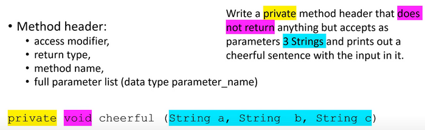
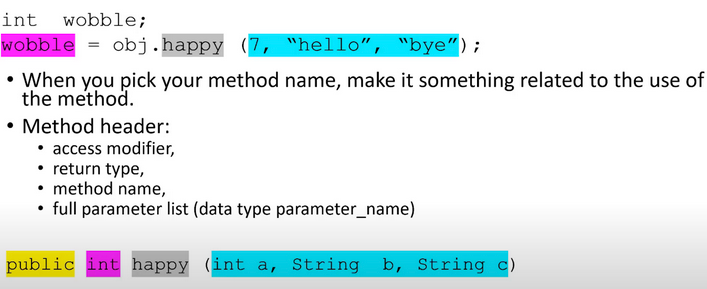

Worked Example: Writing Method Headers 2
==================================================

.. topic:: Subgoals for Writing Methods

   1. Define method header based on problem

   2. Define return statement at the end
      
   3. Define method body/logic

      a. Determine types of logic (expression, selection, loop, etc)
      b. Define internal variables
      c. Write statements
      

You can watch this video or read through the content below it.

.. youtube:: V0zh2Mi_11o
   :divid: video-methods-we2
   :align: center

--------------------------------------------------------------------------------------------------------------------------------------

Problem 1: Write a public method that does not return anything but accepts as parameters 3 Strings and prints out a cheerful sentence with the input in it.

---------------------------------------------------------------------------------------------------------

* When you pick your method name:

   * Make it something related to the use of the method.
   * Recall that method names are never capitalized at the first letter.
   * We will call this method **cheerful**
   
* A full method header contains:

   * access modifier, 
   * return type, 
   * method name, and
   * full parameter list (data type parameter_name)
   

.. code-block:: java

   public void cheerful (String a, String b, String c) {}
    
A call to this method would look like: ``obj.cheerful(alpha, beta, gamma");``

---------------------------------------------------------------------------------------------------------

Problem 2: Write a public method header that would work for this call:

.. code-block:: java

   int  wobble;
   wobble = obj.happy (7, "hello", "bye");

---------------------------------------------------------------------------------------------------------

A full method header contains:

   * access modifier, 
   * return type, 
   * method name, and
   * full parameter list (data type parameter_name)
   

.. code-block:: java

   public int happy (int a, String b, String c) {}
      
      
.. topic:: Practice Pages

   .. toctree::
      :maxdepth: 1

      methods-we2-p1.rst
      methods-we2-p2.rst