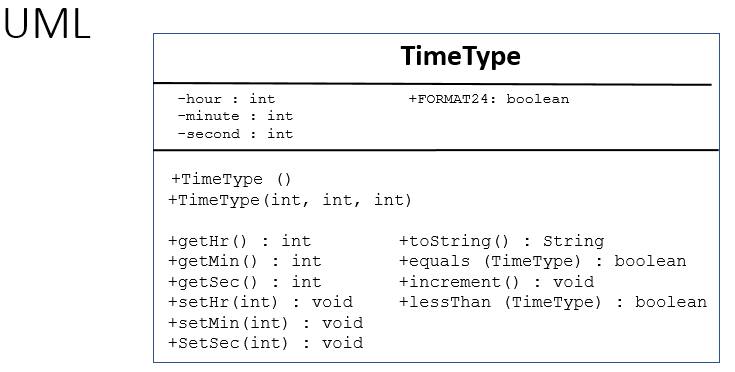

Worked Example: Writing Classes - Overrides and Other
========================================================

.. topic:: Subgoals for Writing a Class 4/4

   1. Name it 

   2. Differentiate class-level (static) vs. instance/object-level variables  

   3. Differentiate class-level (static) vs. instance/object behaviors/methods 
   

   4. Define class variables (static) as needed '
   
      A. Name 
      B. Data Type 
      C. public / private / final 
      
      
   5. Define instance variables (that you want to be interrelated)  

      A. Name 
      B. Data Type 
      C. private 
      
   6. Create constructor (behavior) that creates initial state of object  

      A. public
      B. Same name as class
      C. No return type
      D. Default - no parameters
      E. Logic - initialize all variables
      F. Repeat as needed, adding parameters 
      
   7.  Create 1 accessor and 1 mutator behaviors per attribute
   
      A. Accessors 

         a. Name is get_<attr_name> 
         b. Public 
         c. Return type same data type as attribute
         d. No parameters 
         e. Logic - return value

      B. Mutators 
      
         a. Name is set_<attr_name>
         b. Public
         c. Return type is void 
         d. Parameter is same data type as attribute
         e. Logic validates input parameter and sets attribute value
      
   8. Write toString method
   
      A. public
      B. Returns String
      C. No parameters
      D. Logic - convert needed attributes to a format that can be printed 
   
   9. Write equals method 
   
      A. public 
      B. Returns boolean
      C. Parameter - instance of the class
      D. Logic - compare attributes for equity
      
   10. Create additional methods as needed 

You can watch this video or read through the content below it.

.. youtube:: sCkGax6he70
   :divid: video-writeclass-we4
   :align: center

--------------------------------------------------------------------------------------------------------------------------------------------------------------------------------------------

Problem: We will be writing a class to represent an instance of time, like a specific time in the day.

Now write toString, equals, and any other methods we need.

   
---------------------------------------------------------------------------------------------------------

.. topic:: SG8: Write toString method

   A. public
   B. Returns String
   C. No parameters
   D. Logic - convert needed attributes to a format that can be printed 
   
   .. code-block:: java
   
      public String toString() {
         String holder= "";
         if (hour < 10)
            holder = "0"; 
         holder += hour + ":"; 
         if (minute < 10) 
            holder += '0';
         holder += (minute + ":");
         if (second < 10)
            holder += '0';   
         holder += second;
         return holder;
      }
      
      
.. topic:: SG9:  Write equals method

   A. public 
   B. Returns boolean 
   C. Parameter - instance of the class 
   D. Logic - compare attributes for equity 
   
   .. code-block:: java
   
      public boolean equals (TimeType other) {
      
      return (hour == other.hour && 
         minute == other.minute && 
         second == other.second);
         
      // alternate logic
	  // return  toString().equals(other.toString());
      
      }
      
   
.. topic:: SG10: Write other methods

   For additional functionality, we will implement two more instance methods.

   .. code-block:: java

      public void increment() {
         second++;
         if (second > 59) {
            second = 0;
            minute++;
         }
         if (minute > 59) {
            minute = 0;
            hour++;
         }
         if (hour > 23) {
            hour = 0;
         }
      }
      
      public boolean lessThan (TimeType other) {
         boolean result = false;
         if (hour < other.hour)
            result = true;
         else if (hour > other.hour)
            result = false;
         else {
            if (minute < other.minute)
               result = true;
            else if (minute > other.minute)
               result = false;
            else  {
               if (second < other.second)
                  result = true;
               else
                  result = false;
            }
         } 
         return result;   
      }

      
      
After writing methods, this is a good time to review the structure of the class and test with a main driver program.

.. code-block:: java

   public static void main (String [] args) {
      TimeType noon = new TimeType(12, 0, 0);
      System.out.println("noon: " + noon); //concat auto-calls toString
      TimeType dueTime = new TimeType(23, 59, 59);
      System.out.println("The due time is " + dueTime);
      for (int i = 0; i < 362; i++) {
         dueTime.increment();
         System.out.println("The due time is " + dueTime);         
      }
      if (dueTime.lessThan(noon))
         System.out.println("dueTime less");
      else
         System.out.println("noon less");
   }
   
   
.. topic:: Practice Pages

   .. toctree::
      :maxdepth: 1

      classes-we4-p1.rst
      classes-we4-p2.rst