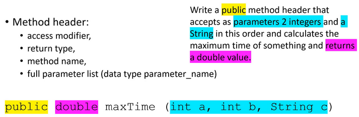

Worked Example: Writing Method Headers
==================================================

.. topic:: Subgoals for Writing Methods

   1. Define method header based on problem

   2. Define return statement at the end
      
   3. Define method body/logic

      a. Determine types of logic (expression, selection, loop, etc)
      b. Define internal variables
      c. Write statements
      

You can watch this video or read through the content below it.

.. youtube:: E6WIWdiVWzU
   :divid: video-methods-we1
   :align: center

--------------------------------------------------------------------------------------------------------------------------------------

Problem: Write a public method header that accepts as parameters 2 integers and a String in this order and calculates the maximum time of something and returns a double value.

---------------------------------------------------------------------------------------------------------

For this Worked Exmaple, we will focus on SG1: Define method header based on problem.

* When you pick your method name:

   * Make it something related to the use of the method.
   * Recall that method names are never capitalized at the first letter.
   * We will call this method **maxTime**
   
* A full method header contains:

   * access modifier, 
   * return type, 
   * method name, and
   * full parameter list (data type parameter_name)
   

.. code-block:: java

   public void maxTime (int a, int b, String c) {}
    
A call to this method would look like:

.. code-block:: java

   double x = obj.maxTime(5, 3, "happy");

      
      
.. topic:: Practice Pages

   .. toctree::
      :maxdepth: 1

      methods-we1-p1.rst
      methods-we1-p2.rst